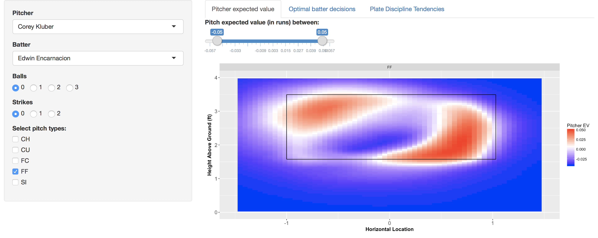
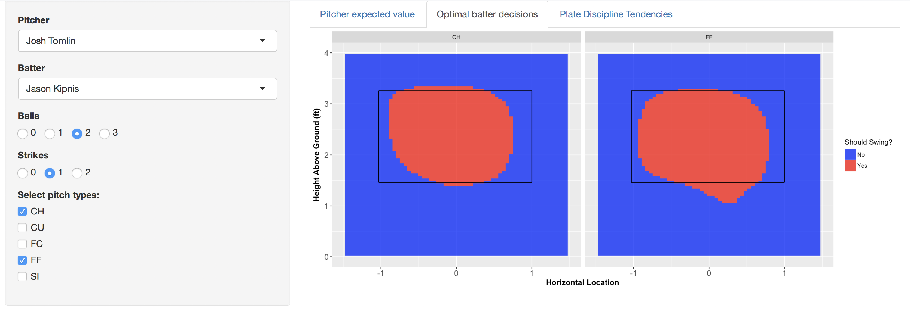
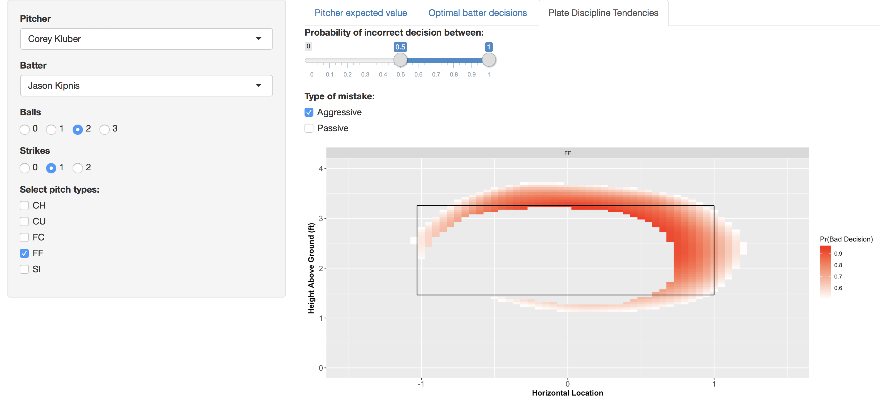

# PitchWise

PitchWise is an interactive tool to visualize matchup-specific maximally
exploitative strategies for both batters and pitchers by count.  Based on a series of machine learning models, it uses physical characteristics of a pitch along with latent player and ballpark embeddings to predict the distribution of outcomes of a pitch.  The Shiny app and data in this repository represent a publicly available demo version of this tool, consisting of two pitchers and two batters from the Cleveland Indians.  Each matchup is assumed to take place at the end of the 2017 season.

## Instructions
1) Download the repository and set it as your working directory.
2) Make sure that you have installed the [Shiny](https://github.com/rstudio/shiny) and [Tidyverse](https://github.com/tidyverse/tidyverse) R packages.
3) If you are using the R console, run `runApp("app_demo.R")`.  If you are using RStudio, click on the **Run App** button at the top right of the editor.

## Features
#### Pitcher Expected Value
The expected value (from the pitcher's perspective) of pitches by location and count is visualized in the first tab.  This takes into account typical physical characteristics of the pitch, as well as batter tendencies and hitting strengths.  Users have the option to choose the batter, pitcher, count, and pitch types they would like to see.  In addition, they can filter pitch locations with an expected value in a certain range.  For example, we can find the expected value of Corey Kluber's four-seam fastball against Edwin Encarnacion at various locations on a 0-0 count. Notice that a well-located fastball is worth around a tenth of a run more than a fastball well off the plate.

  

#### Optimal batter decisions
In the second tab, the optimal batter swing/take strategy is shown by pitch type and count.  In general, optimal batting strategy is selective when ahead in the count and defensive when behind in the count.  This can vary by pitch type: against Josh Tomlin, Jason Kipnis should be trying to drive fastballs low and inside but should lay off changeups in that part of the zone.

  

#### Plate discipline tendencies
In the third tab, we can see the situations in which a batter tends to make suboptimal swing/take decisions.  For example, against pitches that look similar to Corey Kluber's fastball, Jason Kipnis tends to be too aggressive when the pitch comes up and in.  This can be very valuable for teams who want to train batter plate discipline.  
  
